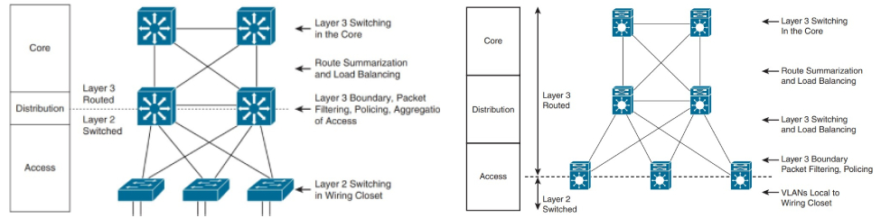

# Exemples de Modèles Hiérarchiques

Le modèle hiérarchique peut être mis en oeuvre en utilisant deux approches différentes pour concevoir un réseau de campus : la conception traditionnelle en commutation (Switched Hierarchical Design) ou la conception en réseau routé.

## Conception en commutation traditionnelle

Dans ce cas, le réseau de campus est principalement basé sur la commutation Ethernet. Les segments du réseau local (LAN) sont connectés à l'aide de commutateurs Ethernet. Cette conception est généralement adaptée aux environnements où la commutation de couche 2 est suffisante pour répondre aux besoins de connectivité.

Layer 3 links entre le core et distribution sont recommandées pour permettre au protocole de routage de prendre en charge l'équilibrage de charge (load balancing) et la redondance rapide des routes en cas de panne de liaison (link).