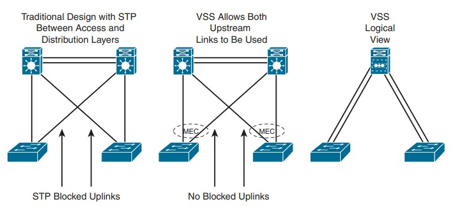

# Exemples de Modèles Hiérarchiques

Le modèle hiérarchique (ou land design) peut être implémenté de deux manières pour concevoir un réseau de campus : la conception traditionnelle en commutation (Switched Hierarchical Design) ou la conception en réseau routé (Routed Hierarchical Design).

## Comparaison entre les deux approches 

Caractéristique | Switched Hierarchical | Routed Hierarchical
-----           | ----                      | ----             
*`Description générale`* | *Principalement commutation Ethernet pour réseaux de couche 2.* | *Commutation de couche 3 centrée sur la couche d'accès.*
*`Recommandation`* | *Utilise des liens de couche 3 (Layer 3 links) pour la redondance.* | *Équilibre la charge (load balancing) dès la couche d'accès.*
*`Rôle de la couche de distribution`* | *Sépare les couches 2 et 3. Achemine les communications inter-VLAN. L’agrégation (ou summarization) de routes* | *Pas de rôle spécifique de couche de distribution.*
*`Inconvénient majeur`* | *Manque d'équilibrage de charge ("Spanning Tree" permet uniquement à l'un des liens redondants)* | *N/A.*
*`Avantage clé`* | *N/A.* | *Équilibrage de charge dès la couche d'accès et facilité du routage.*

## Virtual Switching System (VSS)

Le Virtual Switching System (VSS) est une solution qui assure la redondance entre les commutateurs d'accès et de distribution. Il combine deux commutateurs de distribution physiques en un seul commutateur logique

> [!NOTE] 
> VSS éliminant le besoin d'utiliser des protocoles de redondance comme le Spanning Tree Protocol (STP), le Hot Standby Router Protocol (HSRP), le Virtual Router Redundancy Protocol (VRRP) et le Gateway Load Balancing Protocol (GLBP)..

Avantages | Description
-----           | ----            
*`Commutation de couche 3 vers la couche d'accès`* | *Améliore la continuité des communications en utilisant 'Layer 3 switchin" vers la couche d'accès.* 
*`Gestion simplifiée d'une configuration unique`* | *Simplifie la gestion grâce à une configuration unique du commutateur de distribution VSS.*
*`Meilleur retour sur investissement (ROI)`* | *Augmente la bande passante entre la couche d'accès et la couche de distribution, offrant un meilleur ROI.*
*`Multichassis EtherChannel (MEC)`* | *Crée des technologies sans boucle et élimine le besoin du protocole Spanning Tree.*

