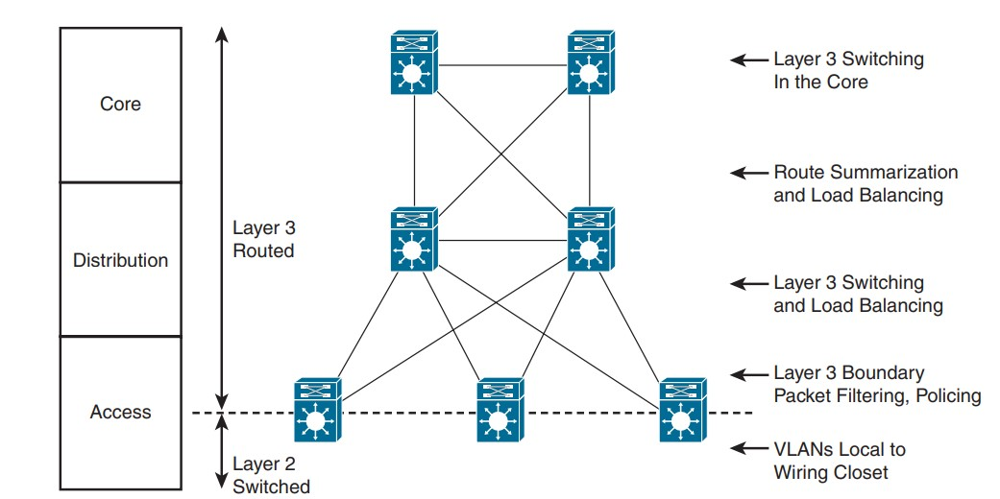

# Exemples de Modèles Hiérarchiques

Le modèle hiérarchique peut être mis en oeuvre en utilisant deux approches différentes pour concevoir un réseau de campus : la conception traditionnelle en commutation (Switched Hierarchical Design) ou la conception en réseau routé.

## Conception en commutation (Switched Hierarchical Design)

Dans ce cas, le réseau de campus est principalement basé sur la commutation Ethernet. Les segments du réseau local (LAN) sont connectés à l'aide de commutateurs Ethernet. Cette conception est généralement adaptée aux environnements où la commutation de couche 2 est suffisante pour répondre aux besoins de connectivité.

Layer 3 links entre le core et distribution (no switchport) sont recommandées pour permettre au protocole de routage de prendre en charge l'équilibrage de charge (load balancing) et la redondance rapide des routes en cas de panne de liaison (link).

La couche de distribution constitue la limite entre les domaines de couche 2 et le réseau routé de couche 3. Les communications inter-VLAN sont acheminées dans la couche de distribution. La "Route summarization" est configurée sur les interfaces vers la couche principale.

> [!NOTE]
> L'inconvénient de cette conception est que le protocole "Spanning Tree" permet à un seul des liens redondants entre le commutateur d'accès et le commutateur de distribution d'être actif. En cas de panne, le deuxième lien devient actif, mais à aucun moment l'équilibrage de charge n'a lieu.

## La conception en réseau routé (Routed Hierarchical Design)

Dans cette conception, la limite de la couche 3 est repoussée vers la couche d'accès. La commutation de couche 3 se produit dans les couches d'accès, de distribution et principales. Le filtrage des routes est configuré sur les interfaces vers la couche d'accès. La synthèse des routes est configurée sur les interfaces vers la couche principale.

> [!NOTE]
> L'avantage de cette conception est que l'équilibrage de charge s'effectue à partir de la couche d'accès car les liaisons vers les commutateurs de distribution sont routées.

Le choix entre ces deux approches dépend des besoins spécifiques de l'organisation, de la taille du réseau, de la complexité des exigences de routage et de la redondance souhaitée. La conception en commutation traditionnelle est souvent plus simple à mettre en oeuvre, tandis que la conception en réseau routé offre une plus grande flexibilité pour la gestion des politiques de routage et des VLAN.