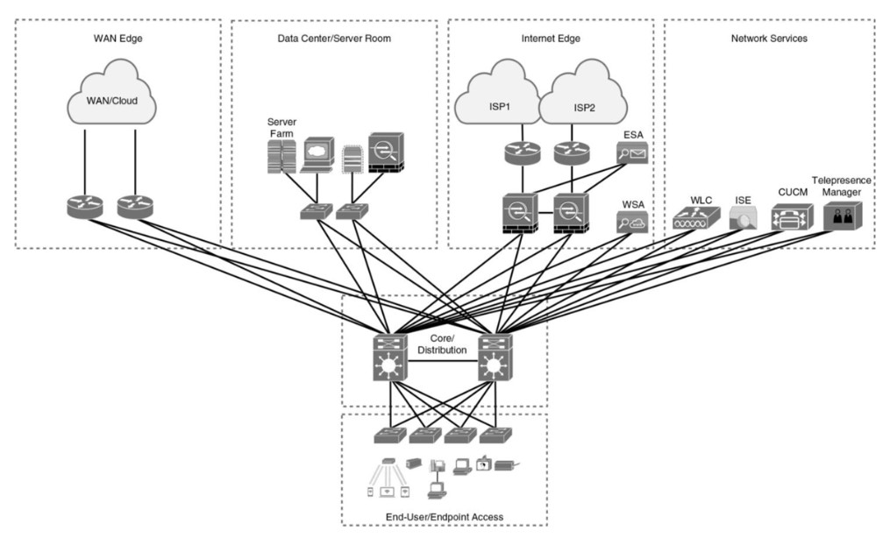

# Exemples de Modèles Hiérarchiques

Le modèle hiérarchique (ou `land design`) peut être implémenté de deux manières pour concevoir un réseau de campus : `la conception traditionnelle en commutation` (Switched Hierarchical Design) ou `la conception en réseau routé` (Routed Hierarchical Design).

## Comparaison entre les deux approches 

Caractéristique | Switched Hierarchical | Routed Hierarchical
-----           | ----                      | ----             
*`Description générale`* | *Principalement commutation Ethernet pour réseaux de couche 2.* | *Commutation de couche 3 centrée sur la couche d'accès.*
*`Recommandation`* | *Utilise des liens de couche 3 (Layer 3 links) pour la redondance.* | *Équilibre la charge (load balancing) dès la couche d'accès.*
*`Rôle de la couche de distribution`* | *Sépare les couches 2 et 3. Achemine les communications inter-VLAN. L’agrégation (ou summarization) de routes* | *Pas de rôle spécifique de couche de distribution.*
*`Inconvénient majeur`* | *Manque d'équilibrage de charge ("Spanning Tree" permet uniquement à l'un des liens redondants)* | *N/A.*
*`Avantage clé`* | *N/A.* | *Équilibrage de charge dès la couche d'accès et facilité du routage.*

## Virtual Switching System (VSS)

Le `Virtual Switching System` (VSS) est une solution qui assure la redondance entre les commutateurs d'accès et de distribution. Il `combine` deux commutateurs de distribution physiques en un seul commutateur `logique`.

> [!NOTE] 
> VSS éliminant le besoin d'utiliser des `protocoles de redondance` comme le `Spanning Tree Protocol (STP)`, le Hot Standby Router Protocol (`HSRP`), le Virtual Router Redundancy Protocol (`VRRP`) et le Gateway Load Balancing Protocol (`GLBP`).

Avantages | Description
-----           | ----            
*`Commutation de couche 3 vers la couche d'accès`* | *Améliore la continuité des communications en utilisant 'Layer 3 switchin" vers la couche d'accès.* 
*`Gestion simplifiée d'une configuration unique`* | *Simplifie la gestion grâce à une configuration unique du commutateur de distribution VSS.*
*`Meilleur retour sur investissement (ROI)`* | *Augmente la bande passante entre la couche d'accès et la couche de distribution, offrant un meilleur ROI.*
*`Multichassis EtherChannel (MEC)`* | *Crée des technologies sans boucle et élimine le besoin du protocole Spanning Tree.*

## 2-Tier (Collapsed Core)

Une alternative à la hiérarchie à trois couches est la conception "`collapsed core`", qui est une hiérarchie à `deux couches` utilisée dans les réseaux plus petits ou les environnements où une conception à trois couches complète n'est peut-être pas nécessaire.

> [!NOTE] 
> Cette conception est généralement utilisée dans des scénarios tels qu'un `seul bâtiment avec plusieurs étages`. les couches de core et distribution sont fusionnées en une `seule` couche.

## Hub-and-Spoke

La conception du réseau en étoile (`Hub-and-Spoke`) offre des temps de `convergence` plus rapides que la topologie en `anneau` (ring topology). De plus, la conception en étoile est plus évolutive et plus facile à gérer que les topologies en anneau ou `maillées` (mesh). 

Par exemple, la mise en oeuvre de politiques de sécurité dans une `topologie maillée complète` (full-mesh topology) deviendrait difficile à gérer, car nous devrions configurer des politiques à chaque emplacement. En utilisant la formule `n(n - 1)/2`, un mesh de 8 appareils générerait `8 (8 - 1)/2 = 56/2 = 28 liens`, ce qui peut devenir difficile à gérer en termes de complexité et de maintenance.

> [!NOTE] 
> La conception du réseau en étoile est souvent préférée dans de nombreuses situations en raison de sa `facilité de gestion`, de sa rapidité de `convergence` et de son `évolutivité` par rapport à d'autres topologies comme l'anneau ou le maillage.

## Full-Mesh

Dans une topologie de maillage complet (`Full-Mesh`), chaque appareil serait connecté à chaque autre appareil, créant un réseau hautement interconnecté. Cela offre une grande redondance et des itinéraires de communication multiples, mais cela peut devenir `complexe` et `coûteux` à mesure que le réseau s'agrandit.

 Appareil | Liaisons Directes 
---------|-------------------
    A    | B, C, D          
    B    | A, C, D          
    C    | A, B, D          
    D    | A, B, C          

Les avantages d'une topologie de maillage complet comprennent une redondance maximale. Cependant, il y a des `inconvénients` à cette approche. Le principal inconvénient est la complexité et le coût associés au `câblage` et à la `gestion de nombreuses liaisons directes`, en particulier dans les réseaux de grande taille. De plus, la configuration et la maintenance d'une topologie de maillage complet peuvent devenir fastidieuses à mesure que le nombre d'appareils augmente.

## Partial Mesh

En contraste, une topologie de maillage partiel (`Partial Mesh`) est une configuration où certains appareils ne sont pas directement connectés à tous les autres. Autrement dit, un maillage qui n’est pas un maillage complet.

> [!NOTE] 
> Les réseaux réels utilisent ces idées de topologie, mais il est courant qu'ils les combinent : `Conception hybride`, intégrant des concepts topologiques dans une architecture plus étendue, généralement plus complexe.

## Conception PoE et LAN