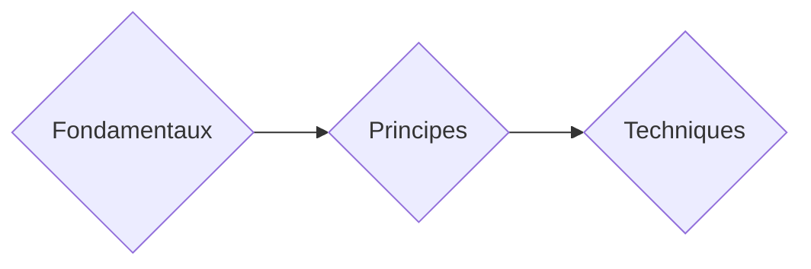

# Éléments Clés dans la Conception

La conception de réseaux comporte `plusieurs éléments essentiels` qui assurent sa solidité et sa fonctionnalité. Il est utile de les considérer comme les différentes composantes de la construction d'une maison :

1. Les `fondamentaux` de la conception de réseau (comme les fondations d'une maison).
2. Les `principes` de conception de réseau (comme la charpente de la maison).
3. Les `techniques` de conception de réseau (comme un toit pour la maison).

Éléments | Détails
-----            | ----                   
*`Techniques`* | *Isolation des défaillances (`Failure Isolation`); État de défaillance partagé (`Shared Failure State`); Blocs de construction modulaires (`Modularity Building Blocks`); Hiérarchie de conception (`Hierarchy of Design`); Assemblage (`Putting It All Together`)* 
*`Principes`* | *Sécurité (`Security`) ; Extensibilité (`Scalability`); Disponibilité (`Availability`); Coût (`Cost`); Gérabilité (`Manageability`)*
*`Fondamentaux`* | *Mentalité (`Mindset`); Exigences (`Requirements`); Cas d'utilisation de la conception (Design `use cases`); L'entreprise (The `business`); Contraintes (`Constraints`); "Pourquoi" (“`Why?`”)* 

Chacun de ces éléments est essentiel pour créer un `réseau fiable et efficace`. Les fondamentaux fournissent la base, les principes établissent la structure, et les techniques apportent les solutions pratiques. En comprenant et en utilisant ces éléments, les concepteurs de réseau peuvent créer des environnements réseau robustes et adaptés aux besoins de l'entreprise.