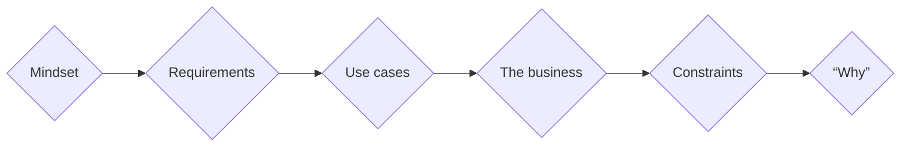

# Fondamentaux de la conception

La compréhension des fondamentaux de la conception de réseau est essentielle pour élaborer des réseaux performants et adaptés aux besoins de l'entreprise. Voici les éléments clés de ces fondamentaux :

Éléments | Détails
-----            | ----                   
*Mentalité (Mindset)* | *Les besoins fonctionnels (comment les technologies ou les systèmes répondront aux besoins de l'entreprise); Les besoins techniques se concentrent sur la manière dont le système fonctionne et s'intègre (Sécurité, Disponibilité et Intégration); Les besoins liés aux applications (Quality of Experience (QoE); Utilisateur final: Clients, Utilisateurs internes, Partenaires commerciaux)* 
*Exigences (Requirements)* | *La portée de la conception (Design Scope) est cruciale dans tout projet de conception de réseau, nécessitant une analyse minutieuse pour recueillir des informations et planifier efficacement la conception.*
*Cas d'utilisation de la Conception* | *Nouvelle Implémentation (Greenfield); Implémentation sur Réseau Existant (Brownfield); Ajout de Technologie ou d'Application; Remplacement de Technologie; Fusion ou Désinvestissement (Merge or Divest); Extension du Réseau (Scaling a Network); Échec de conception (Design Failure)* 
*L'entreprise (The business)* | *En tant que concepteurs de réseau, vous faisez ce que vous faisez pour le bien des entreprises, des sociétés et des organisations que vous soutenez.* 
*Contraintes (Constraints)* | *Lois de la conception : Contraintes liées à l'entreprise, Contraintes liées aux applications, Contraintes technologiques; Coût (Cost); Délai (Time); Emplacement (Location); Infrastructure; Compétence du personnel former le personnel (risque de temps de résolution des problèmes et coûts de temps d'arrêt) ou embaucher des experts (coûteux, ce qui peut annuler les avantages de coût "TCO");* 
*"Pourquoi" (“Why”) ?* | *Quels problèmes résolvez-vous avec cette technologie?  Comment se déroulent actuellement les flux de travail de vos employés ou de vos clients ? Comment cette technologie modifiera ces flux de travail ? Comment votre entreprise (gouvernance, politiques, processus et culture) évoluera-t-elle grâce à cette technologie ?* 

En intégrant ces fondamentaux dans notre processus de conception, nous serons mieux préparé à créer des réseaux qui répondent aux besoins de l'entreprise et qui sont solides du point de vue technique.