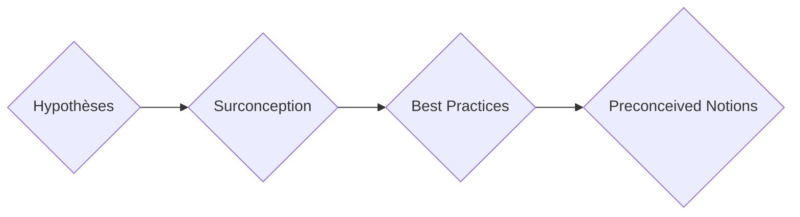

# Les pièges de la conception réseau

Les pièges de la conception réseau sont parmi les erreurs de conception réseau les plus courantes que vous puissiez commettre. Ce sont les écueils qui peuvent littéralement compromettre toute conception réseau que vous créez ou toute décision de conception réseau que vous prenez.

Éléments | Détails
-----            | ----                   
*Faire des hypothèses* | *Dans n'importe quelle situation de conception, vous ne voulez jamais supposer quoi que ce soit. Bien sûr, vous pouvez avoir des hypothèses, mais ne prenez pas de décisions de conception basées sur une hypothèse tant que vous n'avez pas validé cette hypothèse; Reliez tout à l'entreprise et aux exigences.* 
*Surconception (Gold plating)* | *Ajout d'éléments de conception qui sont excessifs et ne répondent à aucune exigence (requirement) sous-jacente.*
*Meilleures pratiques (Best Practices)* | *Nous ne pouvons pas tomber dans le piège des "meilleures pratiques". Au lieu de cela, nous prenons en considération les meilleures pratiques et nous les modifions, les ajustons pour chacune de nos décisions de conception en fonction des besoins de l'entreprise.* 
*Idées préconçues* | *Les idées préconçues sont des croyances influencées par des expériences passées. En conception réseau, il est essentiel de ne pas laisser ces préjugés influencer les décisions. Par exemple, aimer un protocole de routage ne signifie pas qu'il convient à toutes les situations.*

> [!NOTE]
> La conception doit toujours être liée aux exigences commerciales du client !