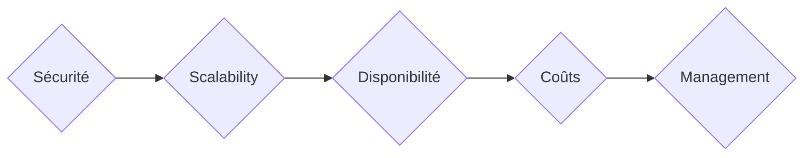

## Principes de conception

Lors de la conception d'un réseau, plusieurs principes doivent être pris en compte pour garantir son efficacité et sa fonctionnalité. Voici cinq principes de conception de réseau essentiels :

Éléments | Détails
-----            | ----                   
*Sécurité omniprésente (Pervasive Security)* | *Sécurité du périmètre (alias coquille de tortue): l'ancienne méthode de sécurisation (Parefeu); Sécurité basée sur les sessions et les transactions: authentification à 100 %, suivi d'une autorisation à 100 % de chaque session et transaction; Architecture Zero Trust : Temps réel basée sur l'intelligence artificielle/apprentissage automatique (IA/ML); Exigences de conformité (HIPAA; NIST, PCI DSS). Si une entreprise n'est pas conforme, elle sera déconnectée ou complètement arrêtée, c'est-à-dire fermée et mise hors service* 
*Extensibilité (Scalability)* | *Il ne s'agit pas seulement d'adapter le réseau à la croissance, mais aussi de rendre l'entreprise plus flexible.  En permettant à l'entreprise de s'adapter rapidement à ses besoins changeants, le réseau devient un moteur de croissance plutôt qu'un simple centre de coûts.* 
*Changement de la disponibilité* | *La disponibilité englobe tous les sujets : redondance, Résilience (alias robustesse), fiabilité, et bien plus encore. C'est ici que les exigences non déclarées commencent à entrer en jeu; La disponibilité des applications et des services*
*La gestion des coûts* | *Le coût n'est pas toujours financier ; il peut également s'agir d'un coût en ressources. Le personnel, le temps et les coûts techniques tels que la mémoire, le processeur, le stockage, la bande passante, l'énergie et la climatisation sont autant de coûts que vous devez gérer en tant que concepteur de réseau.* 
*Limitation de la complexité...Gestion (Manageability)* | *Maintenir la simplicité dans la conception du réseau pour en faciliter la gestion; Dans certaines situations, une conception plus complexe peut être nécessaire, la gestion de la complexité est essentielle pour garantir que le réseau peut être correctement exploité et maintenu.*

Ces principes de conception sont essentiels pour garantir que le réseau fonctionne de manière optimale, qu'il s'adapte aux besoins de l'entreprise et qu'il reste sécurisé et gérable.

> [!NOTE]
> Concept d'exigences non déclarées (Unstated Requirements) : N'oubliez pas que les clients ne spécifient pas toujours clairement leurs besoins, ce qui laisse aux concepteurs de réseau le soin de déterminer ces exigences. Chaque principe de conception du réseau devient ainsi une exigence non déclarée à prendre en compte.