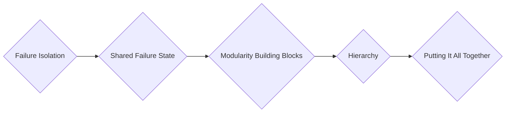

# Techniques de conception

La conception d'un réseau peut être sujette à des `erreurs et à des problèmes` de mauvaise conception. Il est crucial d'éviter ces pièges pour maintenir un réseau fiable et performant. Cette section met en lumière certaines des techniques de conception de réseau les plus courantes, que tout concepteur de réseau doit maîtriser pour prévenir les erreurs de conception et corriger celles qui ont été introduites par d'autres.

Éléments | Détails
-----            | ----                   
*`Isolation des défaillances` (Failure Isolation)* | *Cette technique consiste à concevoir des mécanismes pour prévenir `la propagation` des défaillances au sein du réseau, évitant ainsi des pannes généralisées; Créer des `limites` (boundaries) au sein du réseau* 
*`État de défaillance partagé` (Shared Failure State ou aka fate sharing)* | *Identifiez et gérez les points potentiels de défaillance qui pourraient être partagés par plusieurs composants du réseau; Il est essentiel de concevoir des mécanismes de `redondance` ou de `mitigation` pour éviter ou minimiser les effets de l'état de défaillance partagé*
*`Blocs de construction modulaires` (Modularity Building Blocks)* | *La "`modularité`" est un concept qui permet d'utiliser `des blocs de construction` spécialement conçus pour des objectifs `particuliers`; Utilisez des modules `indépendants` pour construire le réseau, facilitant ainsi la maintenance et l'évolutivité.* 
*`Hiérarchie de conception` (Hierarchy of Design)* | *Organisez le réseau en couches pour une gestion plus efficace, permettant une meilleure structuration des éléments du réseau; Les couches les plus couramment utilisées dans l'architecture hiérarchique d'un réseau sont les suivantes : Couche `Core` (Noyau), Couche `Distribution` (Distribution), Couche `Aggregation` (Agrégation), Couche `Access` (Accès)* 
*`Assemblage` (Putting It All Together)* | *`Intégrez tous les éléments` de conception pour créer un réseau opérationnel et fonctionnel.* 

La compréhension et la maîtrise de ces techniques de conception permettent de créer des environnements réseau solides, capables de répondre aux besoins de l'entreprise et de minimiser les erreurs potentielles de conception.