# Installer EVE-NG sur WMware

L'installation d'`EVE-NG` sur VMware est un processus qui nous permet de créer une plateforme de virtualisation de réseau pour tester des configurations réseau. Voici les étapes pour réaliser cette installation.

#### `Objectif 4 : Installer EVE-NG sur WMware`

## Installation et configuration

*`Étape 1`* : Téléchargement de la dernière version d'EVE-NG :

- Commençons par télécharger la dernière version d'EVE-NG Community Edition (Version 5.0.1-19) depuis le site Web officiel d'EVE-NG : [Site Web EVE-NG](https://mega.nz/file/mtUnHIoA#h5TtEOQModzgTtk9xX7vVSYmLh1jN0ISqmhpacunopA).

*`Étape 2`* : Préparation du fichier d'image

- Placez le fichier `EVE-COM-5.0.1-19` dans un répertoire de votre choix.

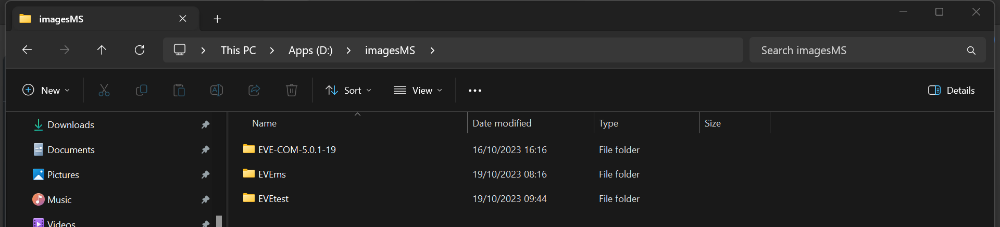

- Double-cliquez sur le fichier `.VMDK` d'EVE-NG.

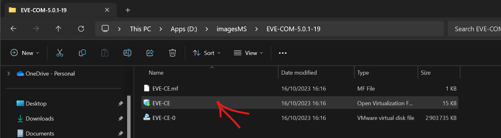

- Ouvrez automatiquement le fichier dans VMware Workstation Pro.

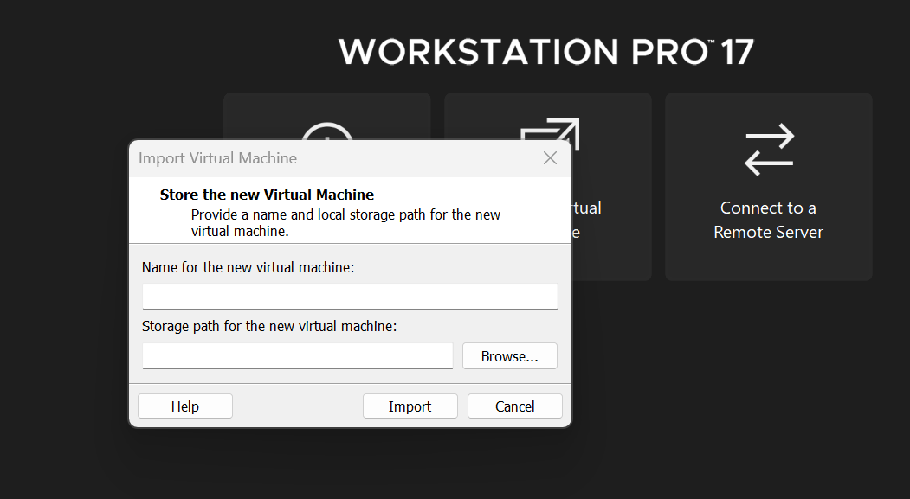

- L'importation de la machine virtuelle EVE-NG commencera. Attendez quelques minutes que l'importation soit terminée.

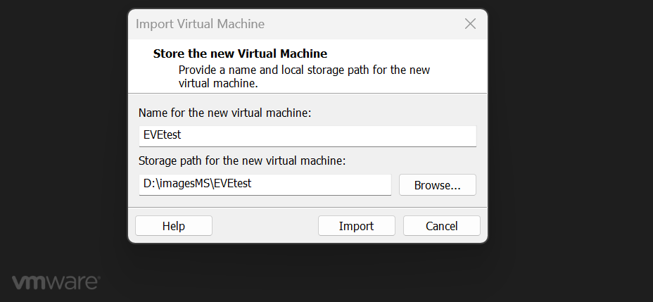

- Une fois l'importation terminée, cliquez sur "**`Upgrade this virtual machine`**" pour ajuster les paramètres de la machine virtuelle:

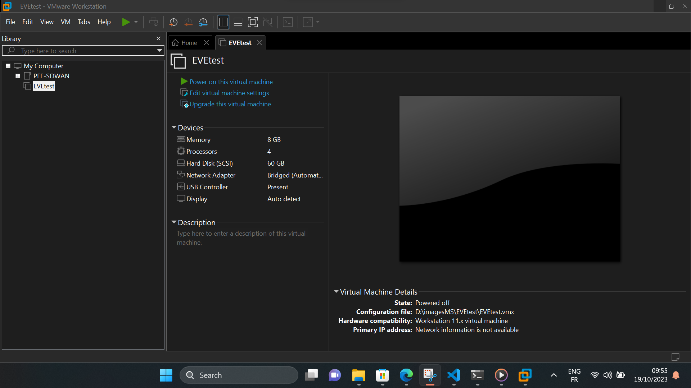

- Modifiez les paramètres par défaut, tels que la `mémoire` (20 Go), le `réseau` (NAT), le `nombre de coeurs` CPU (4), et `l'espace disque` (150 Go). Cliquez sur "****OK".

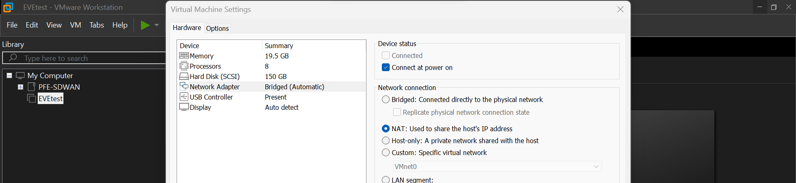

- Après avoir apporté ces modifications, cliquez à nouveau sur "**`Upgrade this virtual machine`**", puis suivez les étapes pour changer "**`hardware compatibility`**" en Workstation 17.

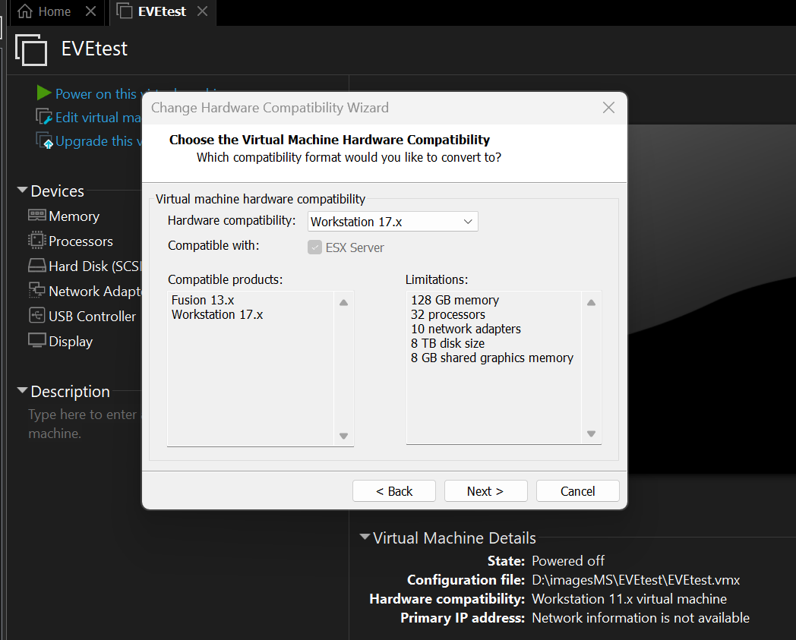

- Choisissez "**`Alter this virtual machine`**", suivez les étapes et cliquez sur "**`Finish`**".

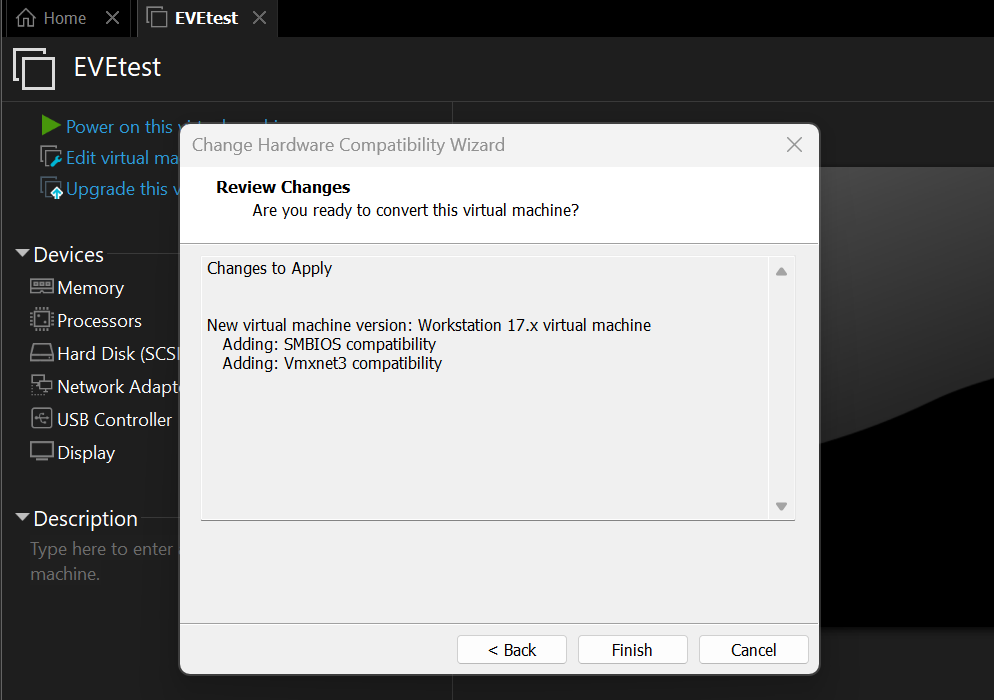

## Démarrage d'EVE-NG

- Après quelques minutes, notre machine virtuelle EVE-NG sur VMware Workstation sera installée. Pour commencer à utiliser EVE-NG, cliquez sur "**`Power on this virtual machine*`*".

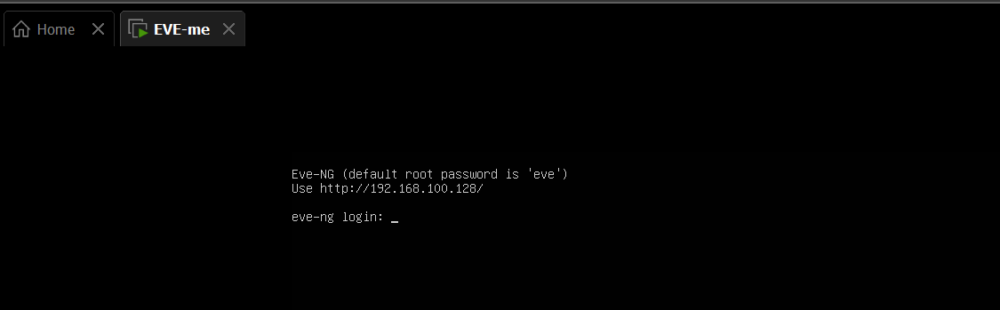

Connectez-vous en utilisant les informations d'identification par défaut (`Login : root, Password : eve`).

> [!WARNING] 
> Les informations d'identification par défaut sont Login : `root` et Password : `eve`.

## Configuration finale d'EVE-NG

Lorsque nous exécutons EVE-NG pour la première fois, suive les étapes à l'écran, qui incluent une fenêtre bleue où nous devrons appuyer sur "**OK**" à chaque fois. Les étapes d'installation et de configuration spécifiques peuvent varier en fonction de la version d'EVE-NG que vous avez téléchargée.

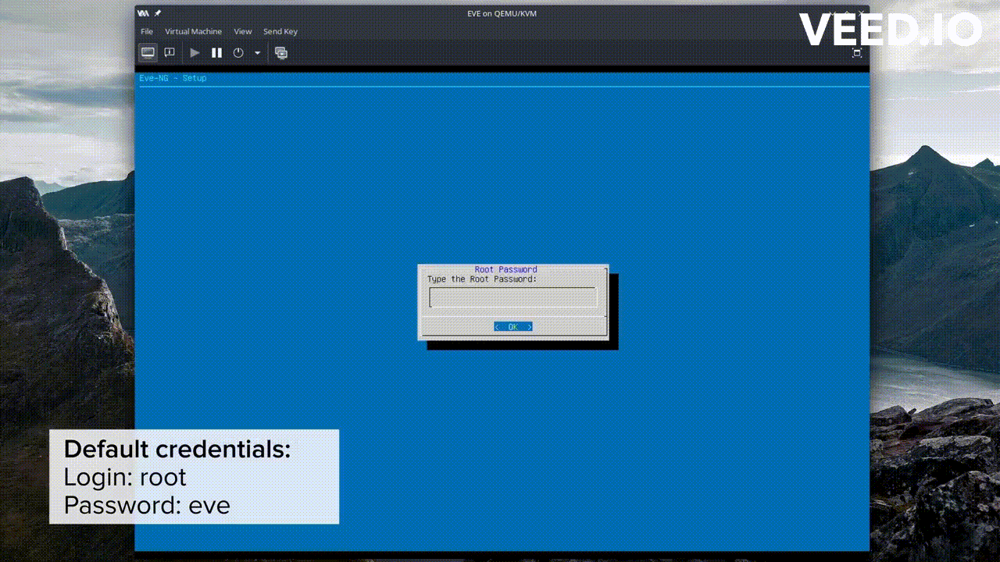

- `Mises à jour du système`: Une fois la configuration d'EVE-NG terminée, assurez-vous de mettre à jour votre système en exécutant les commandes suivantes :

```bash
sudo apt-get update
sudo apt-get upgrade
sudo apt-get dist-upgrade
```

- `Redémarrez` la machine virtuelle EVE-NG pour appliquer les mises à jour :

```bash
sudo reboot
```

> [!NOTE]
> Nous devrions maintenant être prêt à utiliser `EVE-NG` pour la virtualisation de réseaux.

- Ouvrir EVE-NG dans notre navigateur "**`Firefox Developer`**" :

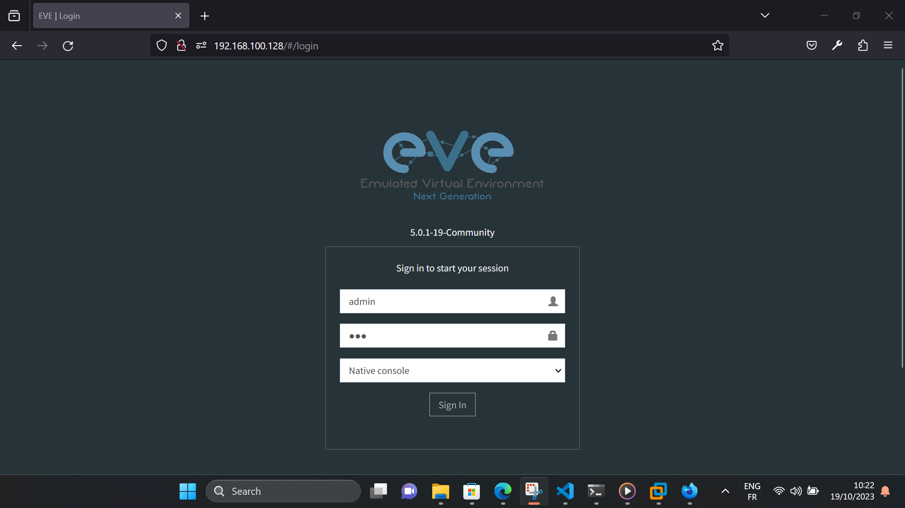

## Installer Windows Client Side

Si vous souhaitez installer le client Windows, vous pouvez le télécharger depuis [Windows Client Side](https://www.eve-ng.net/index.php/download/#DL-WIN).

## Ressources supplémentaires

- Pour plus de détails, vous pouvez consulter les liens suivants: [EVEng Documentation](https://www.eve-ng.net/index.php/documentation/)