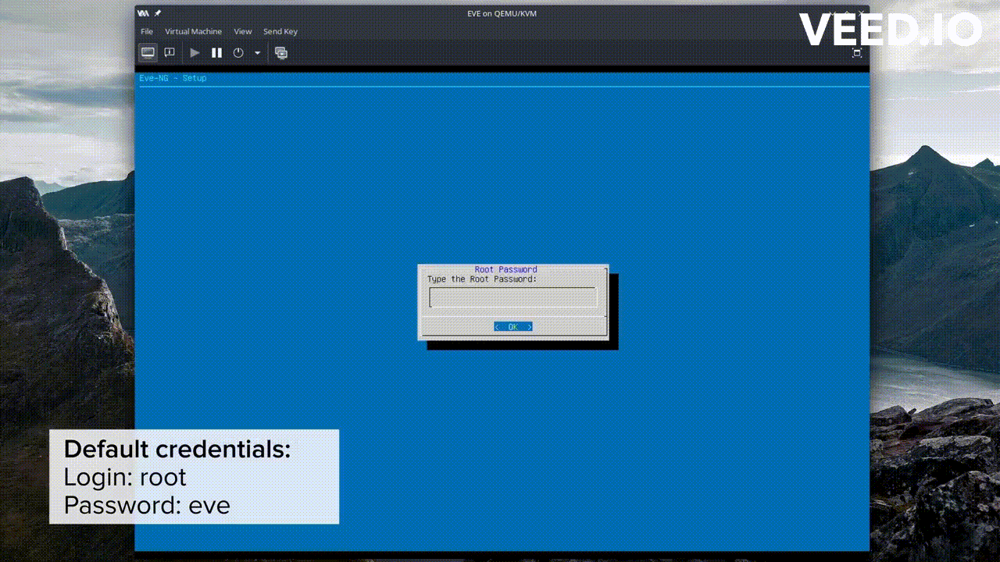

# Installer EVE-NG 

`EVE-NG` (Emulated Virtual Environment - Next Generation) est un logiciel de virtualisation réseau. 

#### `Objectif 4 : Installer EVE-NG sur KVM/Qemu`

## Installation et configuration

Voici les étapes pour l'installation et la configuration d'EVE-NG (Emulated Virtual Environment - Next Generation) :

*`Étape 1`* : Téléchargement de la dernière version d'EVE-NG :

Téléchargez la dernière version de la communauté gratuite d'EVE-NG (Version 5.0.1-19) depuis le site Web d'EVE-NG : [Site Web EVE-NG](https://mega.nz/file/mtUnHIoA#h5TtEOQModzgTtk9xX7vVSYmLh1jN0ISqmhpacunopA).

*`Étape 2`* : Préparation du fichier d'image

- Placez le fichier `EVE-CE-0.vmdk` dans un répertoire de votre choix.


- Utilisez la commande `qemu-img` pour convertir le fichier d'image au format `.vmdk` en `.qcow2` :

```bash
qemu-img convert -f vmdk -O qcow2 EVE-CE-0.vmdk EVEms.qcow2
```

- Donner une taille de `80 Go` à EVEms.qcow2.

```bash
qemu-img resize EVEms.qcow2 80G
```

*`Étape 3`* : Configuration de Virt-Manager

- Lancez `Virt-Manager` en utilisant la commande suivante :

```bash
virt-manager
```

- Dans `Virt-Manager`, ajoutez l'image `EVEms.qcow2` en suivant ces étapes :


*`Étape 4`* : Configuration finale d'EVE-NG

Lorsque vous exécutez EVE-NG pour la première fois, suivez les étapes à l'écran, qui incluent une fenêtre bleue où nous devrons appuyer sur "OK" à chaque fois. Les étapes d'installation et de configuration spécifiques peuvent varier en fonction de la version d'EVE-NG que vous avez téléchargée.



*`Étape 5`* : Mises à jour du système

- Après avoir configuré EVE-NG, exécutez les commandes suivantes pour mettre à jour notre système :

```bash
sudo apt-get update
sudo apt-get upgrade
sudo apt-get dist-upgrade
```

*`Étape 6`* : Redémarrage de la machine virtuelle EVE-NG

Redémarrez la machine virtuelle EVE-NG pour appliquer les mises à jour :

```bash
sudo reboot
```
> [!NOTE]
> Nous devrions maintenant être prêt à utiliser EVE-NG pour la virtualisation de réseaux.

## Installer Linux Client Side

Cette version de EVE-NG Integration prend en charge divers schémas d'URL tels que `telnet://`, `capture://`, `docker://`, et `vnc://` (via Vinagre). De plus, elle inclut un script pour travailler avec les fichiers `.rdp` générés par EVE-NG, ce qui facilite l'intégration de cette solution sur des systèmes Ubuntu/Debian et d'autres distributions Linux.

Pour Windows : [Windows Client Side](https://www.eve-ng.net/index.php/download/#DL-WIN).

*`Étape 7`* : Télecharger Linux Client Side

[Packages in “eve-ng-integration”](https://launchpad.net/~smartfinn/+archive/ubuntu/eve-ng-integration/+packages)


- Alternativement, vous pouvez installer `eve-ng-integration` depuis le terminal à l'aide de la commande suivante :

```bash
# Vous pouvez installer eve-ng-integration à partir du PPA officiel :
sudo add-apt-repository ppa:smartfinn/eve-ng-integration
sudo apt-get update
sudo apt-get install eve-ng-integration
```

> [!WARNING]
> La configuration de `wireshark-common` offre la possibilité d'installer `Dumpcap` de manière à permettre aux membres du groupe système "wireshark" de `capturer des paquets`. La question posée est : *"Les utilisateurs non superutilisateurs devraient-ils être autorisés à capturer des paquets ?"*.


Si vous utilisez une distribution de type `Debian`, nous pouvons exécuter la commande suivante et choisir la réponse `Oui` (si on veut):

```bash
sudo usermod -a -G wireshark $USER
sudo dpkg-reconfigure wireshark-common
```

## Ressources supplémentaires

- Pour plus de détails, vous pouvez consulter les liens suivants: [EVEng Documentation](https://www.eve-ng.net/index.php/documentation/), [Linux Client Side sur Github](https://github.com/SmartFinn/eve-ng-integration), [PPA](https://launchpad.net/~smartfinn/+archive/ubuntu/eve-ng-integration)