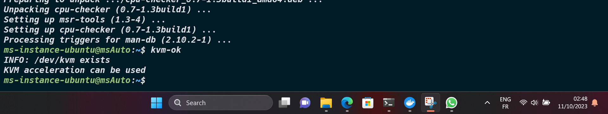

# Virtualisation avec KVM

Pour installer KVM sur une distribution `Ubuntu` dans WSL 2, nous devrons reconstruire le noyau (kernel) Microsoft. Cela implique le téléchargement de la configuration du noyau, sa modification, et enfin la reconstruction du noyau.

#### `Objectif 2 : Installer KVM sur WSL 2`

Le noyau Microsoft WSL 2 est disponible sur GitHub [WSL2-Linux-Kernel](https://github.com/microsoft/WSL2-Linux-Kernel/)

## Update and upgrade

Nous nous recommandons de maintenir nos packages à jour en utilisant le gestionnaire de packages de notre distribution. Pour Ubuntu, utilisez la commande suivante :

```bash
sudo apt update && sudo apt upgrade
```

> Windows ne gère pas les mises à jour ou les mises à niveau de notre distribution Linux.

## Construire notre propre noyau

1. Utilisons `git` dans Ubuntu pour cloner le code source du noyau WSL 2 :

```bash
git clone --depth 1 https://github.com/microsoft/WSL2-Linux-Kernel
```

2. Installons les `dépendances` nécessaires pour la construction de notre noyau en utilisant apt :

```bash
sudo apt -y install build-essential libncurses-dev bison flex libssl-dev libelf-dev
```

3. Changeons de répertoire en accédant au dossier du projet Git :

```bash
cd WSL2-Linux-Kernel/
```

4. Copions le fichier de config du noyau de Microsoft dans le dossier racine du projet sous le nom `.config` :

```bash
cp Microsoft/config-wsl .config
```

5. Ouvrons le fichier de config avec un éditeur de texte comme Nano, Vim ou `VS Code` :

```bash
#  Nous préférons utiliser VS Code
code . 
```

6. Les modifications manuelles à effectuer sont les suivantes :

```ini
KVM_GUEST=y
CONFIG_KVM=y
CONFIG_KVM_INTEL=m # Pour Intel CPU
CONFIG_KVM_AMD=m # Pour AMD CPU
CONFIG_VHOST=y
```

7. Éditons les options du noyau :

```bash
make menuconfig
```

8. Après un peu de compilation, nous accéderons au menu de `config du noyau Linux`.


9. Accédons à `Processor type and features`, puis `Linux guest support`, et activons `KVM Guest support`. 


10. Ensuite, utilisons les touches fléchées gauche et droite pour sélectionner `Exit` et appuyons deux fois sur Entrée pour revenir au niveau supérieur du répertoire de configuration.

11. Utilisons la touche Entrée pour accéder au répertoire `Virtualisation`. Ici, utilisons la barre d'espace ou la touche `Y` pour le marquer avec un astérisque (*) pour activer le `Kernel-based Virtual Machine (KVM) support`. Activons également `KVM for AMD processors support` en tant que module avec la touche `M`.


12. Sélectionnons "Exit" deux fois et nous serons invités à enregistrer notre nouvelle configuration. Sélectionnons `Yes`.


13. Ensuite, nous construisons notre noyau en utilisant la commande `make`.

> [!WARNING]
> Après avoir exécuté cette commande, nous pourrions rencontrer deux erreurs. La première nous informera que 
> l'outil `bc` (calculatrice binaire) n'est pas installé sur notre système. La deuxième erreur signalera un 
> problème dans la génération du format `BTF` (BPF Type Format) du noyau Linux. Le BTF est essentiel pour le 
> débogage et l'analyse du noyau.

Pour résoudre ce problème, nous devons installer `bc` et `dwarves` sur notre système. Voici comment procéder :

```bash
sudo apt update
sudo apt install bc
sudo apt install dwarves
```

14. Maintenant, nous construisons notre noyau (8 cœurs) :

```bash
make -j 8
```


Ah, les plaisirs de l'observation de la construction du noyau Linux !

15. Si la compilation réussit, nous serons informés que le noyau est prêt :

```bash
Kernel: arch/x86/boot/bzImage is ready
```

16. Maintenant, nous devons créer et installer les fonctionnalités que nous avons signalées comme `modules`. Ils seront installés sur notre système de fichiers de distribution dans `/lib/modules` car ils ne sont pas intégrés au noyau :

```bash
sudo make modules_install
```

17. Déplaçons `notre propre noyau` vers notre système de fichiers Windows pour le rendre accessible à WSL 2 :

```bash
cp arch/x86/boot/bzImage $(wslpath $(wslvar USERPROFILE))
```

18. Ensuite, ouvrons le fichier `.wslconfig` pour utiliser notre noyau personnalisé :

```ini
kernel=C:\\Users\\sella\\bzImage
nestedVirtualization=true
```


19. Créons un fichier appelé `kvm-ms` pour définir les options de notre module "KVM for AMD processors support", appelé `kvm-amd` :

```bash
sudo vim /etc/modprobe.d/kvm-ms.conf
```

20. Ajoutons les options suivantes pour activer la Nested virtualization et d'autres options avancées :

```bash
# Nested virtualization et vitesse
options kvm-amd nested=1
options kvm-amd enable_shadow_vmcs=1
options kvm-amd enable_apicv=1
options kvm-amd ept=1
# Enregistrons et quittons.
```

21. Ensuite, `redémarrons` notre environnement WSL avec notre nouveau noyau :

```powershell
wsl.exe --shutdown # Powershell
```

22. Une fois redémarré, nous pouvons confirmer que nous exécutons le nouveau noyau :

```bash
uname -ar
```


23. Installons un outil appelé `kvm-ok` pour confirmer la disponibilité de la fonctionnalité `KVM nested` :

```bash
sudo apt -y install cpu-checker
# Exécutons "kvm-ok" :
kvm-ok
# Le module générera un message indiquant que "/dev/kvm existe."
```


> [!NOTE]
> Si nous recevons le message `KVM acceleration can be used`, nous avons chargé avec succès le module du noyau > et KVM fonctionne désormais. Félicitations !

24. Enfin, nous pouvons confirmer le support de la KVM nested virtualization et configurer les autorisations d'accès pour `/dev/kvm` :

```bash
cat /sys/module/kvm_intel/parameters/nested # Y ou 1 = is enable
sudo chmod 666 /dev/kvm
```

## Problèmes Potentiels et Solutions

Lors de l'installation de KVM sous WSL 2 Windows, nous pourrions rencontrer *certains problèmes*, mais voici les solutions proposées :

Problème | Description | Statut
-----    | ----            | ----
*Problème 1* | *- WSL ne prend pas en charge systemd*. | *init*
*Problème 2* | *- Acceleration for KVM guests n'est pas activée*. | *disable*
*Solution* | *- Construire notre propre noyau*. | *bzImage*
*Problème 3* | *- KVM support is not available & /dev/kvm does not exist*. | *not available*
*Solution* | *- Chargeons le module du noyau kvm_amd*. | */lib/modules/*

```bash
# Chargeons le module du noyau kvm_amd.
sudo modprobe kvm_amd
```

## Ressources supplémentaires

- Pour plus de détails, vous pouvez consulter les liens suivants: [The Linux Kernel Archives](https://www.kernel.org/), [Genie](https://github.com/arkane-systems/genie), [KVM, qu'est-ce que c'est ?](https://www.redhat.com/fr/topics/virtualization/what-is-KVM), [Microsoft - WSL2-Linux-Kernel](https://github.com/microsoft/WSL2-Linux-Kernel/), [Documentation Ubuntu Linux](https://doc.ubuntu-fr.org/tutoriel/console_commandes_de_base), [ARM vs x86: What's the difference?](https://www.redhat.com/en/topics/linux/ARM-vs-x86), [How to script make menuconfig to automate Linux kernel](https://unix.stackexchange.com/questions/224887/how-to-script-make-menuconfig-to-automate-linux-kernel-build-configuration),
[GNU Make](https://www.gnu.org/software/make/), [eBPF - The Future of Networking & Security](https://cilium.io/blog/2020/11/10/ebpf-future-of-networking/).

## Mots techniques

`Virtualisation, KVM (Kernel-based Virtual Machine), Noyau (kernel) Microsoft, GitHub WSL2-Linux-Kernel, Git, Ubuntu, WSL 2 (Windows Subsystem for Linux 2), Configuration du noyau, Dépendances, apt (Advanced Package Tool), Compilation, BTF (BPF Type Format), bc (calculatrice binaire), Windows, Nested virtualization, modprobe, CPU-checker, systemd, Architecture x86.`