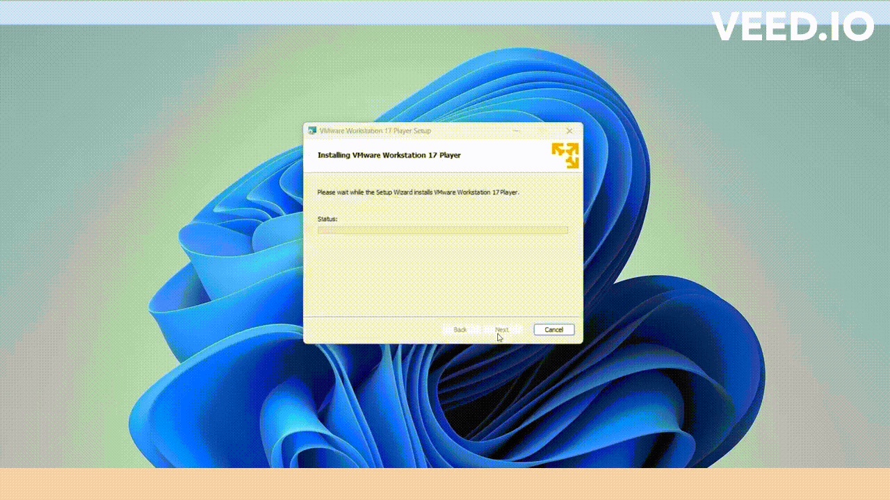

# Installation de VMware sur Windows 11

Pour installer `VMware` sur Windows 11, voici les étapes que nous devons suivre :

## `Activer la virtualisation`

Nous devons d'abord nous assurer que la `virtualisation` matérielle est activée sur notre système hôte, car VMware Workstation en a besoin pour fonctionner. Cette fonction est généralement disponible sur la plupart des PC, mais elle peut être **`désactivée`** dans le `BIOS`. Voici comment procéder :

1. Redémarrons notre PC.
2. Accédons au BIOS de notre système. Nous pouvons généralement y accéder en appuyant sur une touche spécifique (comme F2, F12 ou Supprimer) au démarrage de notre ordinateur. 
3. Dans les paramètres du BIOS, activons la `technologie de virtualisation (VTx)`.
4. Enregistrons les modifications et quittons le BIOS.

## `Téléchargez VMware`

Rendons-nous sur le site officiel de [VMware](https://www.vmware.com/products/workstation-pro/workstation-pro-evaluation.html) pour télécharger la dernière version de VMware Workstation Pro compatible avec Windows 11.

## `Exécution le programme`

Une fois le téléchargement terminé, exécutons le programme d'installation de `VMware Workstation Pro`. Suivons les instructions qui s'affichent à l'écran.

> [!NOTE] 
> Lors de l'installation, nous serons invités à accepter les conditions d'utilisation.

## `Finalisation de l'installation`

Une fois que nous avons choisi les options d'installation, suivons le processus d'installation pour que VMware Workstation soit `installé` sur notre système.

> [!NOTE] 
> Voici une `clé de licence` complète pour VMware Workstation Pro : `4A4RR-813DK-M81A9-4U35H-06KND`

Une fois que la clé de licence est acceptée, nous devrions avoir un accès complet à toutes les fonctionnalités de VMware Workstation Pro.

## `Démarrage de VMware` 

Après l'installation, lançons `VMware Workstation`. Nous serons prêts à créer et gérer des machines virtuelles sur Windows 11.

> [!NOTE]
> Assurez-vous également que votre système Windows 11 répond aux `exigences minimales` de VMware Workstation pour garantir un fonctionnement optimal des machines virtuelles.

## Ressources supplémentaires

- Pour plus de détails, vous pouvez consulter le lien suivant sur *VMware Documentation* : [VMware Workstation Pro Documentation](https://docs.vmware.com/en/VMware-Workstation-Pro/index.html).

## Mots techniques

`VMware, Workstation Pro, BIOS, virtualisation matérielle, technologie de virtualisation (VTx), pilotes VMware, RAM, stockage, machines virtuelles.`