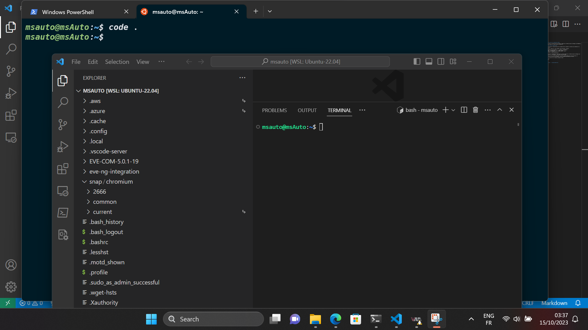
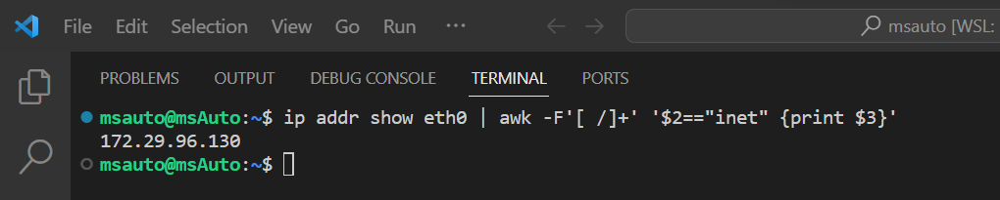
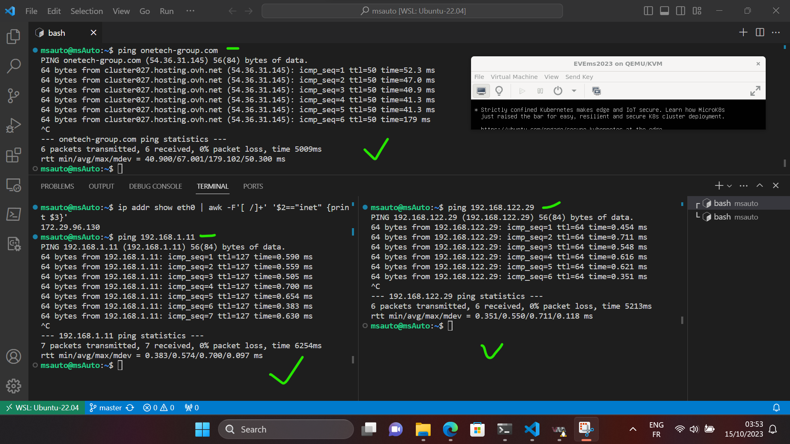
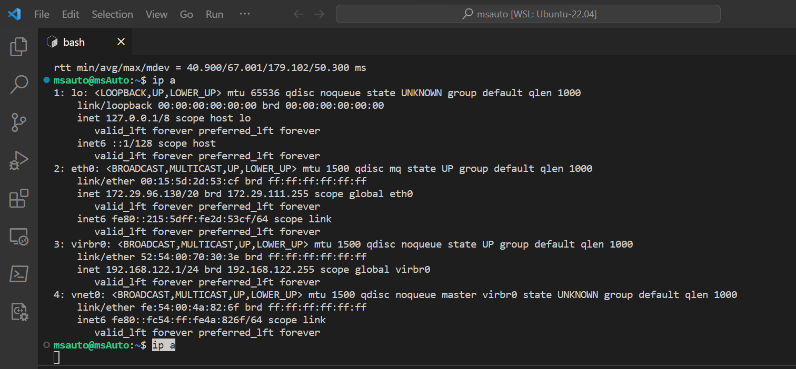
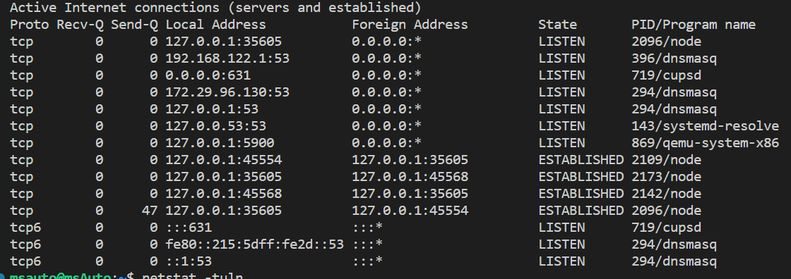
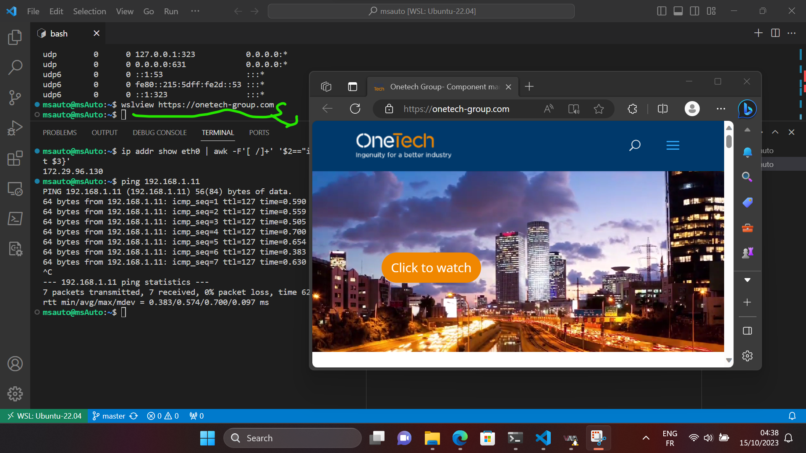
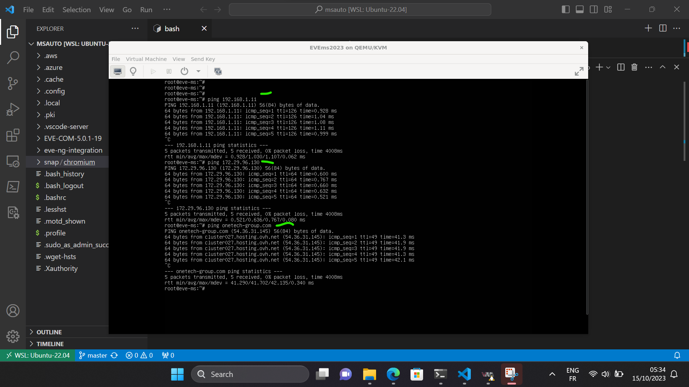
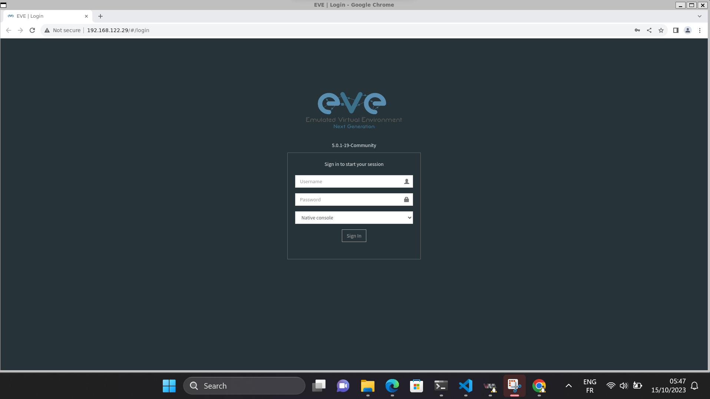

# Vérification de la Connectivité

Pour tester la connexion entre les instances : Ubuntu WSL 2 et EVE-NG exécutant Virt-Manager avec KVM/QEMU sur l'hôte Windows 11, nous devons vérifier la connectivité.

## Informations d'identification

Les informations d'identification pour les appareils pour LAB-SDWAN sont les suivantes :

Composant | Adresse IP | Port | Méthode | Nom d'utilisateur | Password
-----    | ----            | ----
*UbuntuWSL* | *172.29.96.130* | | | *msAuto* | *123456@Mehdi* |
*EVEng* | *192.168.122.29* | | | *root* | *eve* |
*EVEng* | *192.168.122.29* | *80* | *HTTP* | *admin* | *eve* |
*hostWin11* | *192.168.1.11* | | | |  |

Par défault : Routuer ISP 192.168.1.1

Pour vérifier la connectivité réseau entre les instances Ubuntu WSL 2 et EVE-NG exécutant Virt-Manager avec KVM/QEMU sur l'hôte Windows 11, nous pouvons suivre ces étapes :

> [!NOTE]
> Assurons-nous que l'instance Ubuntu WSL 2 et les deux instances EVE-NG sont en cours d'exécution, et installons VS Code sur notre Windows 11 (hôte) et installons l'extension WSL sur VS Code.

## Test pour Instance Ubuntu WSL 2

1. Ouvrons Ubuntu WSL 2 dans le terminal de Windows 11 et tapons :

```bash
code .
```



2. Nous pouvons également utiliser les éléments suivants pour localiser l'adresse IP de notre environnement WSL :

```bash
ip addr show eth0 | awk -F'[ /]+' '$2=="inet" {print $3}'
```



3. Maintenant, testons la connectivité entre :

Source | Dest | IP   | Test
-----    | ----        | ---- | ----
*UbuntuWSL* | *Windows 11 (hosts)* | 192.168.1.11 | *`Pass`*
*UbuntuWSL* | *EVEng instance (KVM/QEMU)* | 192.168.122.29 | *`Pass`*
*UbuntuWSL* | *Internet* | onetech-group.com | *`Pass`*

```bash
ping 192.168.1.11 # Windows 11 (hosts)
ping 192.168.122.29 # EVEng instance
ping onetech-group.com # Internet
```



4. D'après la sortie de la commande "ip a", voici les informations sur les interfaces réseau de notre instance Ubuntu WSL 2 :

```bash
ip a
```


Interface | Adresse IPv4 | Adresse IPv6
-----    | ----        | ---- | ----
***lo (Loopback)*** | 127.0.0.1/8 | *::1/128*
***eth0*** | *172.29.96.130/20* | *fe80::215:5dff:fe2d:53cf/64*
***virbr0*** | *192.168.122.1/24* | *disable (Virt-Manager)* 

Vous pouvez utiliser ces informations pour mettre en place des règles de pare-feu, des routes ou des configurations réseau appropriées en fonction de vos besoins.

> [!NOTE]
> Virbr0, ou l'interface "Virtual Bridge 0," est utilisée pour le NAT (Network Address Translation). Elle est fournie par la bibliothèque libvirt, et les environnements virtuels (Virt-Manager) l'utilisent pour se connecter au réseau extérieur.

5. Pour vérifier le numéro, le port et le nom du processus :

```bash
sudo netstat -plant
```


6. Nous pouvons aussi ouvrir n'importe quelle URL dans le navigateur Web par défaut de Windows 11 directement sur Ubuntu WSL :

```bash
wslview https://onetech-group.com
```




## Test pour Instance EVEng

Pour tester la connectivité de l'instance EVE-NG, nous pouvons utiliser les informations fournies. Voici comment nous pouvons procéder :

1. Vérification de la connectivité entre l'instance EVE-NG (KVM/QEMU) et Ubuntu WSL 2 avec l'adresse IP :

```bash
ping 192.168.1.11 # Windows 11 (hosts) Pass
ping 172.29.96.130 # Ubuntu WSL2 Pass
ping onetech-group.com # Internet Pass
```



Ces étapes sont effectuées avec succès, cela confirmera que nous avons une connectivité réseau fonctionnelle entre l'instance EVE-NG et notre instance Ubuntu WSL 2, ainsi que Windows 11 (hôte) et Internet.

2. Maintenant, nous allons tester l'ouverture de l'interface graphique d'EVE-NG dans le navigateur. Tout d'abord, nous devons installer manuellement Google Chrome comme navigateur sur Ubuntu WSL 2 (Installer Google Chrome pour Linux) :

```bash
cd /tmp
wget https://dl.google.com/linux/direct/google-chrome-stable_current_amd64.deb
sudo dpkg -i google-chrome-stable_current_amd64.deb
sudo apt install --fix-broken -y
sudo dpkg -i google-chrome-stable_current_amd64.deb
```

Pour le lancer, entrez :

```bash
# Installer Google Chrome pour Linux
google-chrome http://192.168.122.29
```


En résumé, cette vérification de la connectivité et les étapes associées nous permettent de garantir que notre environnement est prêt à être utilisé pour nos projets et activités, offrant une base solide pour notre travail futur.

## Problèmes Potentiels et Solutions

Lors de la vérification de la connectivité réseau, il est possible de rencontrer certains problèmes. Voici quelques problèmes potentiels et leurs solutions :

Problème | Description | Statut
-----    | ----            | ----
*Problème 1* | *- Les instances WSL et EVE-NG ne peuvent pas se connecter*. | *eveng*
*Solution* | *- Assurez-vous que les instances sont en cours d'exécution*. | *ip -a*
*Solution* | *- les adresses IP sont correctes*. | *disable*
*Solution* | *- les règles de pare-feu permettent la communication entre elles.*. | *ufw or Iptables*

Problème | Description | Statut
-----    | ----            | ----
*Problème 2* | *- Le ping vers Internet échoue*. | *ISP*
*Solution* | *- Vérifiez la configuration de la passerelle par défaut*. | *Windows 11*
*Solution* | *- Les règles de pare-feu ne bloquent pas le trafic sortant.*. | *Windows 11*

Problème | Description | Statut
-----    | ----            | ----
*Problème 3* | *- L'installation de Google Chrome échoue sur Ubuntu WSL 2.*. | *Navigateur*
*Solution* | *- Assurez-vous que le package Google Chrome est téléchargé correctement*. | *WSL2 Ubuntu*
*Solution* | *- Suivez les étapes manuelle d'installation*. | *WSL2 Ubuntu*

Problème | Description | Statut
-----    | ----            | ----
*Problème 3* | *- L'accès à l'interface graphique d'EVE-NG dans le navigateur ne fonctionne pas*. | *Navigateur*
*Solution* | *- Vérifiez que Google Chrome est installé, que l'adresse IP est correcte*. | *WSL2 Ubuntu*
*Solution* | *- les ports nécessaires sont ouverts pour l'accès à l'interface graphique.*. | *WSL2 Ubuntu*

Problème | Description | Statut
-----    | ----            | ----
*Problème 3* | *- GPU process exited unexpectedly*. | *Google Chrome*
*Solution* | *- Désactivation de l'accélération matérielle dans les paramètres avancés (chrome://settings/?search=hardware)*. | *Google Chrome*

> [!NOTE]
> Utilisez Google Chrome sur Ubuntu WSL, car nous avons testé Firefox et Chromium, qui fonctionnent, mais il y a des problèmes de D-Bus (notre D-Bus.service fonctionne sur Ubuntu). Nous avons essayé de corriger ces problèmes, mais ils concernent spécifiquement Firefox et Chromium. Nous avons donc choisi d'utiliser Google Chrome.

## Ressources supplémentaires

- Pour plus de détails, vous pouvez consulter les liens suivants: [Exécuter des applications d’interface utilisateur graphique Linux sur WSL](https://learn.microsoft.com/fr-fr/windows/wsl/tutorials/gui-apps), [EVEng](https://www.eve-ng.net/index.php/documentation/), [Installer le navigateur Chrome sur Linux](https://support.google.com/chrome/a/answer/9025903?hl=fr)

## Mots techniques

#Connectivité #Réseau #WSL #EVE-NG #KVM #QEMU #VSCode #Pare-feu #NAT